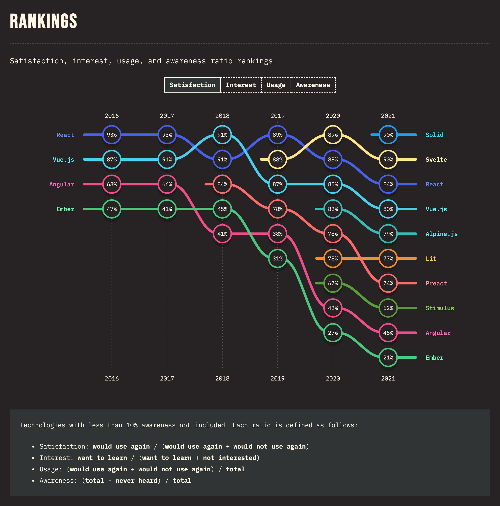
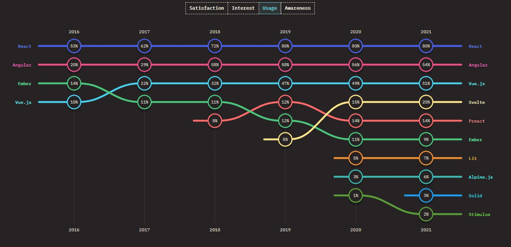

# Svelte

---

# Overview

## Better than React

---

# Satisfaction

---

# Popularity

---

# Don't be stuck in the past

- React in the new jQuery
- jQuery 2006
- React 2013
- many React decisions made sense back then, did not age well
- nobody uses just React
- one React stack is so different from another React stack that it's not that much more work to learn a new framework

---

# Svelte

- familiar design - components, child components, props, state
- more like plain HTML, CSS, and JavaScript
- a lot faster without virtual DOM
- more common features included like scoped CSS, stores, transitions

---

# Hello.svelte

    !html
    
Hello, World!

---

# Scoped CSS built in

## You write:

    !html
    
Hello, World!

    

### Browser sees:

    !html
    
Hello, World!

### And:

    !css
    div.svelte-bl172v { text-align:center; }

---

# State

    !html
    

    <button on:click={handleClick}>
      Clicked {count} {count === 1 ? 'time' : 'times'}
    </button>

---

# Reactive properties

    !html
    

    <button on:click={handleClick}>Count: {count}</button>
    
{count} * 2 = {doubled}

---

# Reactive statements

    !html
    

    <button on:click={handleClick}>
      Clicked {count} {count === 1 ? 'time' : 'times'}
    </button>

---

# Child Components

## Parent.svelte

    !html
    

    <Child answer={42}/>

## Child.svelte

    !html
    

    
The answer is {answer}

---

# {#if}

    !html
    

    {#if user.loggedIn}
      <button on:click={toggle}>
        Log out
      </button>
    {:else}
      <button on:click={toggle}>
        Log in
      </button>
    {/if}

---

# {#each}

    !html
    

    <h1>The Famous Cats of YouTube</h1>

    <ul>
      {#each cats as { id, name }, i}
        <li>
          <a target="_blank" href="https://www.youtube.com/watch?v={id}">
            {i + 1}: {name}
          </a>
        </li>
      {/each}
    </ul>

---

# bind:

    !html
    

    <input bind:value={name} placeholder="enter your name">
    
Hello {name || 'stranger'}!

---

# bind:

    !html
    

    <label>
      <input type=number bind:value={a} min=0 max=10>
      <input type=range bind:value={a} min=0 max=10>
    </label>

    <label>
      <input type=number bind:value={b} min=0 max=10>
      <input type=range bind:value={b} min=0 max=10>
    </label>

    
{a} + {b} = {a + b}

---

# @html

    !html
    

    <textarea bind:value={text}></textarea>

    {@html marked(text)}

    

---

# bind: parent

    !html
    

    <h1 style="color: {pin ? '#333' : '#ccc'}">{view}</h1>

    <Keypad bind:value={pin} on:submit={handleSubmit}/>

---

# bind: child

    !html
    

    

      {#each numbers as i}
        <button on:click={select(i)}>{i}</button>
      {/each}
      <button disabled={!value} on:click={clear}>clear</button>
      <button on:click={select(0)}>0</button>
      <button disabled={!value} on:click={submit}>submit</button>
    

---

# Questions?

## https://svelte.dev/tutorial

## https://svelte.dev/repl

---

# Generated code - create

    !javascript
    c() {
      button = element("button")
      t0 = text("Clicked ")
      t1 = text(/*count*/ ctx[0])
      t2 = space()
      t3_value = (/*count*/ ctx[0] === 1 ? 'time' : 'times') + ""
      t3 = text(t3_value)
    }

---

# Generated code - mount

    !javascript
    m(target, anchor) {
      insert(target, button, anchor)
      append(button, t0)
      append(button, t1)
      append(button, t2)
      append(button, t3)

      if (!mounted) {
        dispose = listen(button, "click", /*handleClick*/ ctx[1])
        mounted = true
      }
    }

---

# Generated code - handleClick

    !javascript
    function instance($$self, $$props, $$invalidate) {
      let count = 0;

      function handleClick() {
        $$invalidate(0, count += 1);
      }

      return [count, handleClick];
    }

---

# Generated code - update

    !javascript
    p(ctx, [dirty]) {
      if (dirty & /*count*/ 1) set_data(t1, /*count*/ ctx[0])
      if (dirty & /*count*/ 1 && t3_value !== (t3_value = (/*count*/ ctx[0] === 1 ? 'time' : 'times') + "")) set_data(t3, t3_value)
    }

---

# Generated code - destroy

    !javascript
    d(detaching) {
      if (detaching) detach(button)
      mounted = false
      dispose()
    }

---

# Questions?

